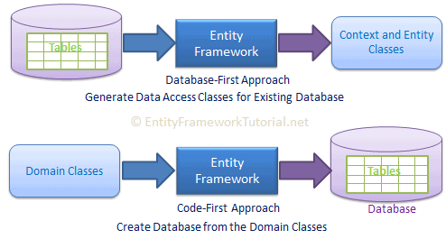
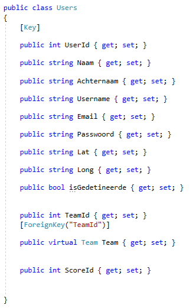
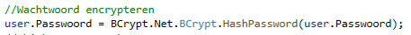
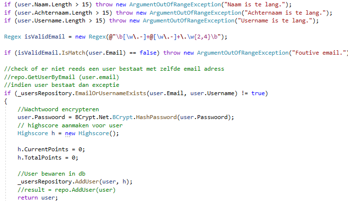
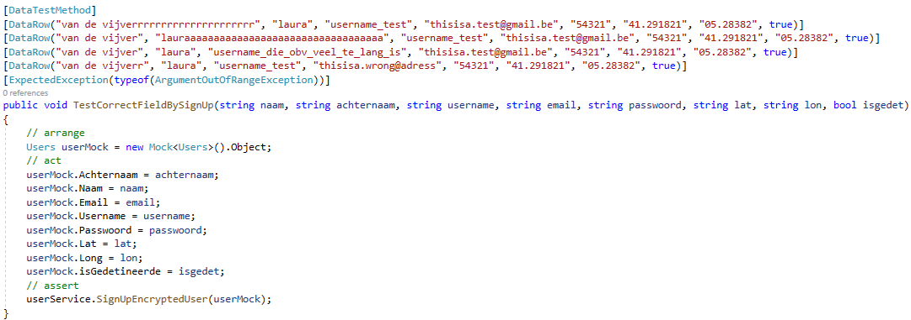

# API Source Code Verduidelijking

Dit document beschrijft met enkele voorbeelden welke functies de API inhoud. Hoe de API juist moet worden aangesproken vind je in het document 'API Documentatie'.

### Data opslag

Om gegenereerde data op te slaan van de gemaakte site en app is er gekozen om Entity Framework te gebruiken. Hierbij heb je enkele opties om een database model te gaan opstellen. Deze opties zijn DBFirst en Code first. Ik heb eerst via database first een database proberen aanmaken. Dit was eerder moeilijk omdat relaties tussen tabellen leggen vrij complex bleek te zijn.

Omdat ik database first geen goede optie vond, heb ik gekozen voor code first. Hier is elke class een object met properties die zo de elementen uit de tabel beschrijven. Door simpelweg een klasse 'dbinitialiser' en hierin enkele objecten toe te voegen maak je de database aan.

### Users

Er is de mogelijkheid om gebruikers aan te maken via de API. Deze gebruikers kunnen zich registreren / aanmelden via email en pass. 

## Password encrytion

Als een gebruiker zich wilt registreren wordt er eerst gekeken of het email adres deze gebruikt al bestaat of niet. Vervolgens word de gebruiker zijn gekozen paswoord versleutelt via de BCrypt functie voor .NET. Deze functie werd aangeraden omdat deze veilig zou zijn. Deze functie gebruikt een blowfish block cipher en intereert meerdere malen zodanig het heel moeilijk is om het paswoord te kraken via bv. rainbow tabels. Het paswoord bevat nu ook een salt.

## Validatie

De business layer is verder ook voorzien van validatie op het meegegeven user object. Zo wordt er onder andere gekeken of de naam niet te lang is of de username niet te lang is... Verder wordt er ook gekeken of het email adress dat verder ook wordt gebruikt om aan te melden, wel een echt email adres is. Dit wordt verwezelijkt via een reguliere expressie. Als de user voldoet aan al deze criteria, wordt deze aangemaakt en krijgt deze ook een unieke highscore toegekend.

## JWT

Nu de user bestaat in de database kan deze zich ook aanmelden. Als de user zich aanmeld krijgt deze ook een JWT mee. Met deze JWT kan er via de site en de app gekeken worden of user die is aangemeld, wel de echte user is.

### Unit testing

Ik heb het aanmaken van users getest op juiste invoer van de velden voor de signup functie. Na het testen bleek dat je bijna alles kon ingeven in deze velden. Nadat ik dit heb getest heb ik mijn business logica hervormt zodat bv. een naam maar een beperkte lengte kan hebben en dat een email adress echt moet zijn, adhv. een reguliere expressie.

