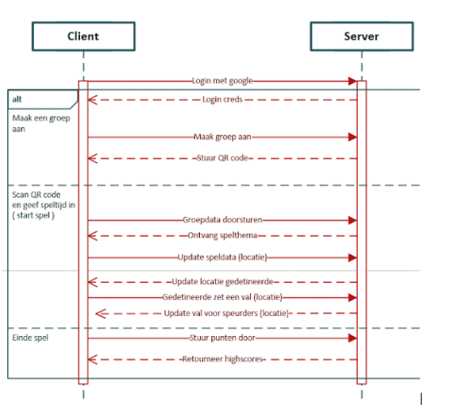

# Ga naar de gitbook voor uitgebreide documentatie https://cityhunt.gitbook.io/cityhunt/

# City Hunt!
## Voorstelling Team

### Maxim Wauters

Backend : ASP.NET Core
Database via Entity Framework
Devops engeneer
### Kasper Ruys

Unity
ASP.NET Core
Scrum Master
### Vital Volckaerts

Frontend : Angular
Publish Azure
Product Owner

### Beschrijving Project

City Hunt!
De bedoeling van het spel is om steden te leren kennen aan de hand van vragen en zo veel mogelijk punten te halen, dat is het hoofddoel van het spel.
Als eerste zal je je moeten aanmelden op de website of op de mobiele applicatie.
Wanneer je bent aangemeld kan je of wel bestaande groepen gebruiken op de app waar er al vragen en abilities in zitten,
of via de website kan je een groepen aanmaken en vragen en abilities toe voegen aan die bepaalde groep.(Dit is handig voor scholen of andere groepsactiviteiten.)
Wanneer je op de app een groep hebt gekozen kan je beginnen aan het spel.
Onderweg komen er een aantal vragen voor waar we hieronder meer over uitleggen.
We werken met een punten systeem door een mix van vragen en aantal abilities.
De vragen variëren ze kunnen gaan over 
-de geschiedenis van de stad
-Leuke weetjes
-Horeca
-Het zoeken van voorwerpen
-...
In het spel heb je ook een aantal bommen die je kan plaatsen, 
deze bommen kan je op verschillende plaatsten in de stad zelf plaatsen aan de hand van coordinaten of een google maps.
wanneer je alle vragen hebt opgelost zie je je totale score.
De score wordt opgeslagen in de database.

### Features
#### Must haves
Kortste route bepaling : voor het bepalen van aantal punten.
AR : voet- en geursporen van gedetineerde naar laatste locatie.
Locatie gebaseerde vragen
API
Special abilities (bommen, vallen, valse locatie, blackout, ...)

#### Nice to have
Extra special abilities (Afstand afgelegd: powerups/bonuses)
Achievments
Geofencing
Camera integratie

### Functioneel design
#### Mockups

#### final result

#### User stories
https://dev.azure.com/s097156/CloudApplications_CityHunt

#### Technisch design
### ER Schema

##### Sequence diagram 

##### State diagram

##### Flow diagram

#### Architecture: 3 layered

Een 3 layer architectuur is een client-server software architectuur patroon waar de user interface   ( presentation ) , functionele logica (business layer) , data opslag en toegang, worden ontwikkelt in apparte modules. In dit geval worden deze aparte modules op verschillende platformen ontwikkelt.

Presentation layer

De taak van deze laag is het visualiseren van de content in de gemaakte applicatie.

Application layer of Business layer

Deze laag zorgt voor het juist afhandelen van de logica die nodig is om de gewenste doelen te bereiken.

Data access layer

Deze laag dient als toegangslaag tot de data die nodig is om het spel te laten werken.

### Used technology

Frontend : Unity app + Angular
Backend : ASP.NET core + entity framework
Deployment : Azure cloud
Visual Studio (code)
Conveyor

